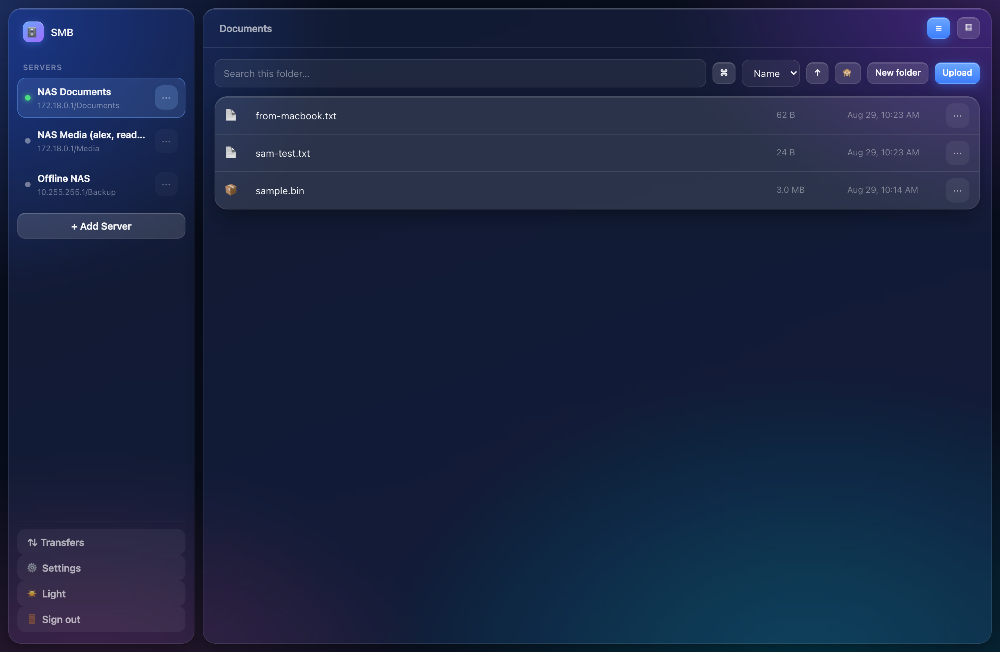
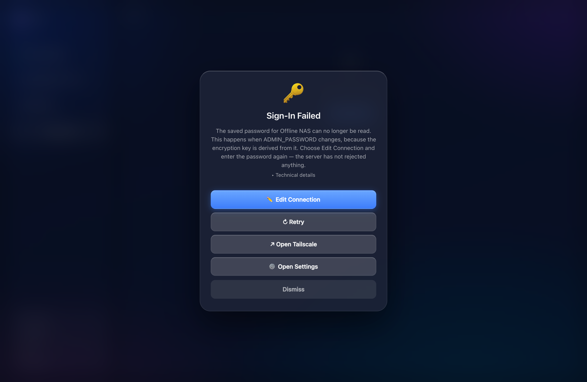
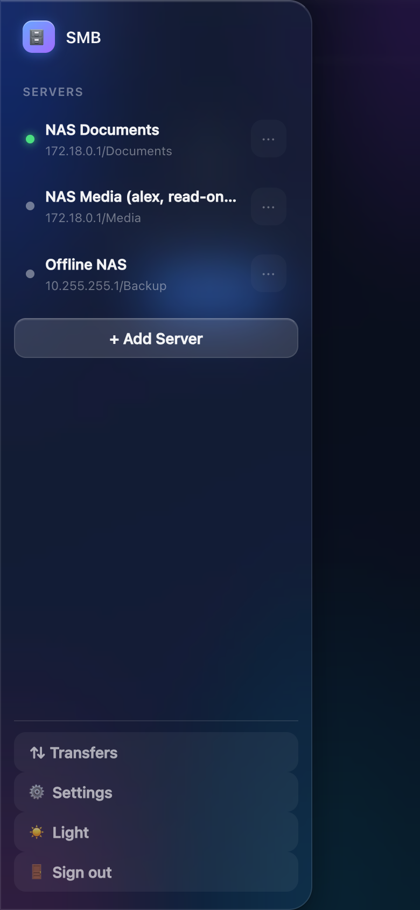
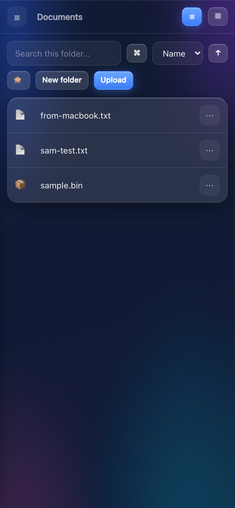

# smb-web-client

A self-hosted **SMB client** with a web UI, in Docker. Connect to SMB/CIFS
shares and browse, upload and download them from any browser on your network —
including a phone, where a native app would otherwise be required.

This is the web port of the [Simple SMB File
Browser](https://github.com/codemastervy/simple-smb-file-browser) iOS/macOS
app: same feature set, same failure handling, and as close to its Liquid Glass
look as CSS honestly gets.

> ### This app is a client. It does not host shares.
>
> It connects **out** to SMB servers. It does **not** run an SMB server, does
> **not** create or manage shares, and does **not** expose this machine's disks
> to anyone. If you want the other half — a NAS dashboard that *creates* shares
> — that is a separate project ([nas-dashboard](https://github.com/codemastervy/nas-dashboard)),
> deliberately kept apart. This one only reads and writes shares that already
> exist somewhere else.

---

## Screenshots

Captured against a real Samba server, showing live share contents.

### Browser



### Connection failure

The full-screen failure modal, with the most useful action promoted — see
[Failure handling](#failure-handling).



### Phone

&nbsp;&nbsp;

---

## Contents

- [Quick start](#quick-start)
- [What it does](#what-it-does)
- [Security model](#security-model)
- [Failure handling](#failure-handling)
- [Differences from the native app](#differences-from-the-native-app)
- [Configuration](#configuration)
- [Backing up](#backing-up)
- [How it works](#how-it-works)
- [Development](#development)
- [Troubleshooting](#troubleshooting)

---

## Quick start

```bash
git clone https://github.com/codemastervy/smb-web-client.git
cd smb-web-client

cp .env.example .env
$EDITOR .env          # set ADMIN_PASSWORD -- the app refuses to serve without it

docker compose up -d --build
```

Open `http://<host>:8081`, sign in, and add a server.

Generate a decent password with:

```bash
openssl rand -base64 24
```

> **Before you set `ADMIN_PASSWORD`, read [Security model](#security-model).**
> It is not only the login — it is also the key your saved SMB passwords are
> encrypted with, so **changing it later makes them unreadable**.

---

## What it does

**Connections.** Add, edit and remove SMB servers. Multiple servers connected
at once, each with its own credentials — including two accounts on the same
host. A **Test** button in the form verifies the details before you save them.

**Browsing.** Navigate, breadcrumbs, search (current folder or recursive),
sort by name/date/size/type, list or grid view.

**Operations.** Upload (with progress), download, rename, move, copy, delete,
new folder, and multi-select batch actions. Right-click on a pointer device,
long-press on a phone. Name collisions de-duplicate (`report.pdf` →
`report 2.pdf`) rather than overwriting.

**Preview.** Images, video, audio, PDF and text render in the browser.

**Transfers.** A panel showing active and recent transfers with progress.

**Settings.** Default view and sort, recursive-search and hidden-file
defaults, saved-server management, and the recovery link.

---

## Security model

The native app ran on your device, where the OS protected its keychain and
nothing was listening on the network. This runs as a **server**, holds
credentials to your file server, and answers HTTP on your LAN — reachable by
every guest phone, smart TV and IoT device on the same subnet. So:

### 1. The app itself requires a login

A single admin password, set by environment variable, exchanged for a signed,
`HttpOnly`, `SameSite=Lax` session cookie. Failed logins are rate-limited (8 per
5 minutes per source address), and the password is compared in constant time.

**With `ADMIN_PASSWORD` unset, every API route returns 503.** It fails closed —
an unauthenticated SMB client on a home network is a real risk, not a
theoretical one.

### 2. Saved SMB passwords are encrypted at rest

Encrypted with Fernet (AES-128-CBC + HMAC-SHA256). The key is derived from
`ADMIN_PASSWORD` with PBKDF2-HMAC-SHA256, **600,000 iterations**, against a
random 32-byte salt stored in the data volume. **The key is never written to
disk.**

Being precise about what that buys you:

| | |
|---|---|
| **Protects against** | The data volume at rest — a stolen backup, a volume snapshot, a copied `servers.json`, anyone who can read the file but not the process environment. Without the admin password those passwords are unreadable. |
| **Does NOT protect against** | Anyone who can read the container's environment (`docker inspect`, a shell in the container, `/proc`). They have `ADMIN_PASSWORD` and can derive the key. This is unavoidable for a service that must reconnect unattended. |

Verified: the API never returns a password in any field, and no plaintext
password appears in `servers.json` — see [`TEST_RESULTS.md`](TEST_RESULTS.md).

### ⚠️ Changing `ADMIN_PASSWORD` invalidates saved SMB passwords

Because the key is derived from it. Saved passwords become undecryptable, and
the app will tell you so plainly — the failure screen says the saved password
can no longer be read and that *the server has not rejected anything* — then
asks you to re-enter it.

This is the correct behaviour: silently keeping them readable would mean the
old password still unlocked them. If you would rather not have this coupling,
set `SESSION_SECRET` explicitly and keep it stable across password changes.

### 3. The container is unprivileged

Runs as **uid 10001, non-root**, with `no-new-privileges`. No host networking,
no added capabilities, no device passthrough, no bind mounts of your disks.
It needs one inbound port for the web UI and outbound TCP/445. That is all —
a pure SMB client needs nothing else.

### 4. Path containment

A saved profile pins one share. Every request path is normalised, and any
`..` segment is **refused** rather than collapsed — a request should never be
trying to climb out, so a client bug or an attempt to reach `\\host\C$` is an
error, not something to quietly fix. Verified against traversal and
cross-share escape attempts in [`TEST_RESULTS.md`](TEST_RESULTS.md).

### Exposing it beyond your LAN

Don't, without TLS. Put it behind a reverse proxy with a certificate. The
session cookie is marked `Secure` automatically when the request arrives over
HTTPS, so a proxy terminating TLS (with `X-Forwarded-Proto` set) gets the right
behaviour with no extra configuration.

---

## Failure handling

Ported from the native app, including the part that matters: **the failure
modal promotes whichever action is most likely to fix the specific failure.**

Raw SMB errors are translated into one of thirteen kinds, matched on the
numeric NT status code (`STATUS_LOGON_FAILURE` = `0xC000006D`, and so on) rather
than on message text, which varies between library versions. Each kind carries
a plain-language message that **names the server**, because "timed out" alone
does not tell anyone which machine went quiet.

| Failure | Message | Leads with |
|---|---|---|
| Wrong password | "…rejected the username or password." | **Edit Connection** |
| Wrong share name | "…is reachable, but the share couldn't be opened." | **Edit Connection** |
| Timed out | "…the connection timed out. Check…any VPN or tunnel." | **Recovery link** |
| Host unreachable | "…couldn't be found on the network." | **Recovery link** |
| Connection refused | "File sharing may be turned off, or SMB may be on a different port." | **Both** |
| Permission denied | "You don't have permission to do that on…" | Retry |

Retry claims the prominent slot only when nothing more specific has. Every
failure also offers **Retry**, **Open Settings** and **Dismiss**, and the raw
error is available under **Technical details** rather than being thrown away.

Retry deliberately does **not** dismiss the modal on its own: a failed retry
replaces the failure with the new one, so you see the fresh reason instead of
being dropped into an empty browser with no explanation.

---

## Differences from the native app

Two are platform limits worth stating rather than papering over.

### 1. The recovery button opens a URL, not an app

The iOS/macOS app launches a VPN or tunnel app directly with a URL scheme —
`tailscale://`, `wireguard://`. **A browser cannot do this reliably.** Custom
schemes are blocked or silently ignored in most contexts, there is no way to
detect whether the app actually opened, and behaviour differs across iOS
Safari, Android Chrome and desktop.

So the web version takes an ordinary `https://` URL and opens it in a new tab.
Point it at your provider's web console — for example
`https://login.tailscale.com/admin/machines`. Configured under
**Settings → Recovery link**.

This is a genuine capability difference, not an equivalent.

### 2. There is no "Device Files" section

The native app browses iCloud Drive and on-device storage alongside SMB, so
files can be moved between a share and the device. A server-side web app has no
equivalent: "the device" would be the container's own filesystem, which this
app deliberately does not expose.

Moving files between a share and your device is done with the browser's own
upload and download, which works from a phone too.

### 3. Everything else is the same

Multiple simultaneous connections, sidebar with status dots, the full browser
with search/sort/grid, all file operations, batch actions, previews, the
transfers panel, the failure modal with prioritised actions, and the settings
page all behave as the native app does.

---

## Configuration

| Variable | Default | Meaning |
|---|---|---|
| `ADMIN_PASSWORD` | *(none)* | **Required.** Gates the UI **and** encrypts saved SMB passwords |
| `AUTH_ENABLED` | `true` | `false` disables the login entirely. See the warning above |
| `SESSION_SECRET` | *(generated)* | Cookie signing key; generated and persisted if unset |
| `SESSION_TTL_SECONDS` | `604800` | Session lifetime (7 days) |
| `SMB_TIMEOUT` | `20` | Connection timeout, seconds |
| `SMB_ENCRYPT` | `false` | Require SMB3 encryption. Off by default because forcing it breaks some older servers |
| `SMB_IDLE_SECONDS` | `300` | Close a session after this long unused, so a NAS can spin its disks down |
| `MAX_UPLOAD_BYTES` | `21474836480` | Largest single upload (20 GB). Enforced **while streaming**, so a client cannot bypass it with a false `Content-Length` |
| `DATA_DIR` | `/data` | Persistent state |
| `LOG_LEVEL` | `INFO` | Python log level |

API docs are served at `/api/docs`.

### Storage

The compose file uses a **named volume**, not a bind mount, and deliberately:
the container runs as a non-root user, and a bind-mounted host directory
arrives owned by the host user, so the app cannot write to it and exits at
startup. If you want the data somewhere visible, fix the ownership first:

```bash
mkdir -p ./data && sudo chown -R 10001:10001 ./data
# then swap the volume line for:  - ./data:/data
```

---

## Backing up

The named volume holds your saved servers and their **encrypted** SMB
passwords. Losing it costs you the connection list, not access to any data.

```bash
docker run --rm -v smb-web-client_smb-web-client-data:/data \
  -v "$PWD:/backup" alpine \
  tar czf /backup/smb-web-client-data-$(date +%F).tar.gz -C /data .
```

The passwords inside are encrypted, but only as strongly as your
`ADMIN_PASSWORD` — and the archive is useless without it, so back that up
separately (in a password manager, not next to the archive).

Restore into a fresh volume:

```bash
docker run --rm -v smb-web-client_smb-web-client-data:/data \
  -v "$PWD:/backup" alpine \
  tar xzf /backup/smb-web-client-data-YYYY-MM-DD.tar.gz -C /data
```

---

## How it works

**Backend: Python + FastAPI + [smbprotocol](https://github.com/jborean93/smbprotocol).**
`smbprotocol` speaks SMB 2/3 in pure Python over an ordinary TCP socket — no
`libsmb2`, no native build, no `mount.cifs`, and therefore **no root and no
`CAP_SYS_ADMIN`**. A client that needed to mount would have needed both.

**Frontend: React + Vite + TypeScript**, hand-written CSS. The glass effect is
`backdrop-filter: blur() saturate()` over a slowly drifting coloured backdrop,
with a brighter top border than bottom — which is what reads as thickness
rather than a flat translucent rectangle. Where `backdrop-filter` is
unsupported, an `@supports` fallback raises panel opacity so text stays legible.

The SPA is built to static files and served by the same FastAPI process, so
deployment is one container with no reverse proxy required.

**Sessions.** `smbprotocol` pools connections per server and supports multiple
sessions on one connection, so two profiles with different credentials on the
same host work simultaneously (verified). An idle reaper closes unused sessions.

---

## Development

```bash
cd backend
python -m venv .venv && source .venv/bin/activate
pip install -r requirements.txt
ADMIN_PASSWORD=dev DATA_DIR=/tmp/smbweb uvicorn app.main:app --reload --port 8081

cd frontend
npm install
npm run dev        # http://localhost:5174, proxies /api to the above
```

Tests:

```bash
docker run --rm -u 0 \
  -v "$PWD/backend/tests:/app/tests:ro" \
  -v "$PWD/backend/pytest.ini:/app/pytest.ini:ro" \
  -w /app smb-web-client:latest \
  sh -c "pip install -q pytest && python -m pytest tests -q"
```

---

## Troubleshooting

**Every API call returns 503.**
`ADMIN_PASSWORD` is not set. The app fails closed on purpose.

**Container exits with `Permission denied: '/data/...'`.**
A bind-mounted data directory owned by the wrong user. See [Storage](#storage).
The startup error names the uid to chown to.

**"The saved password can no longer be read."**
`ADMIN_PASSWORD` changed. Edit the connection and enter the SMB password again.
See [Security model](#security-model).

**"Share Not Found" but the share exists.**
Enter the *share* name, not a path: `Documents`, not `/mnt/data/Documents`.

**Connection times out to a host you can ping.**
SMB is TCP/445. Check a firewall between the container and the server, and that
the server has SMB2 enabled — SMB1 is not supported and will not be.

**Nothing appears from a phone.**
Reach the container's host directly (`http://<host>:8081`). The app has no
mDNS/NetBIOS discovery — it is a client, not a browser of the network.

---

## Licence

MIT.
